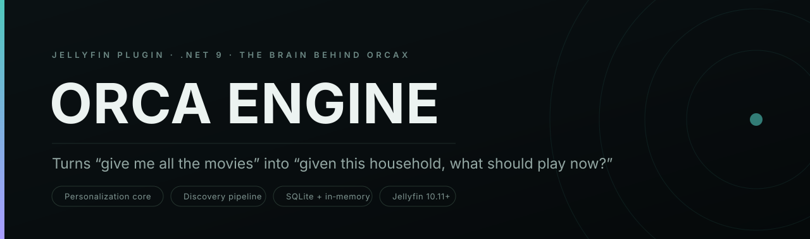
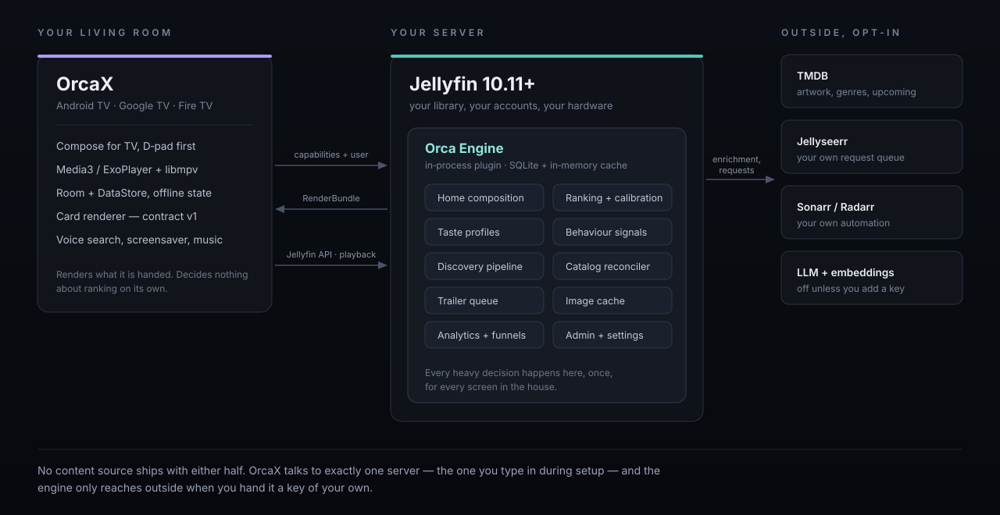
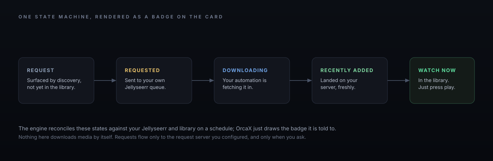

<!-- Orca Engine -->

<p align="center">
  
</p>

<p align="center">
  <a href="#build"></a>
  <a href="#requirements"></a>
  <a href="https://github.com/"></a>
</p>

Orca Engine is a Jellyfin plugin that runs inside your server and does the thinking for the **[OrcaX](https://github.com/)** television client. It is the backbone that turns *"give me all the movies"* into *"given everything this household has watched, what is worth showing right now?"*

The idea is simple. A TV client sitting on a couch is the wrong place to rank a library, keep a taste profile, or reconcile what is available against what is requestable — that work is heavy, it is identical on every screen in the house, and it does not belong on a device you are trying to keep responsive. So the engine does it once, on the server, and hands each client a finished home screen to draw. Every television in the house shares one brain.

---

## What it does

- **Composes the home screen.** Continue watching, new-since-you-were-away, more-like-what-you-finished, mood collections, coming soon, a household Top 10, and cinematic spotlight showcases — assembled server-side into a render contract the client draws verbatim.
- **Ranks and personalizes.** Per-user taste profiles built from real behaviour, with a scoring policy that blends personalization, quality, recency, and availability under weights you control, then calibrates the result.
- **Discovers.** A candidate pipeline with eligibility filtering, diversity, and exploration that can surface titles beyond what is already on the shelf — with an optional taste-aware layer.
- **Reconciles availability.** Keeps a unified view of what is in the library versus what is requestable through your own Jellyseerr, so every card can wear an honest badge: watch now, request, requested, downloading, recently added.
- **Warms trailers.** Predicts what is about to be on screen and prebuffers trailers so they open instantly on focus.
- **Enriches metadata.** Pulls artwork, genres, and upcoming data from TMDB; can generate "did you know" trivia and spoiler-free content advisories.
- **Reports.** Funnel and popularity analytics, source stats, and a small admin surface, all under the same plugin.

---

## Where it sits

<p align="center">
  
</p>

The engine is Tier 1 of a deliberately phased design: an **in-process plugin** backed by SQLite and an in-memory cache, built behind ports and adapters so it can graduate to PostgreSQL/pgvector and Redis (Tier 2) and eventually a standalone companion service (Tier 3) without a rewrite. You get the simplicity of a plugin now and a path to scale later, and nothing in the client contract changes when that happens.

Everything the engine reaches for beyond your server is opt-in and keyed by you. No enrichment, no requests, and no language-model features do anything until you paste in a credential of your own, and the engine only ever talks to the services you configured. It is a decision layer over *your* library, not a gateway to anyone else's.

### The availability model

<p align="center">
  
</p>

Requests flow to the request server you configured and nowhere else, only when a user asks. The engine reconciles the resulting state on a schedule; the client just draws the badge it is handed.

---

## Requirements

- **Jellyfin 10.11+** (target ABI `10.11.0.0`)
- **.NET 9 SDK** to build

## Build

```sh
dotnet build -c Release
```

The plugin assembly (`Wholphin.Engine.dll`) is produced under `Wholphin.Engine/bin/Release/net9.0/`.

## Install (local dev)

Copy `Wholphin.Engine.dll` and its dependencies into a `Wholphin.Engine` folder under your Jellyfin server's `plugins/` directory, then restart Jellyfin. The plugin appears under **Dashboard → Plugins**, and a health check confirms it is live:

```sh
curl http://<your-server>:8096/OrcaEngine/Health
```

---

## API surface

Everything is namespaced under `/OrcaEngine`. A tour of the controllers:

| Route | What it serves |
| --- | --- |
| `/OrcaEngine/Bootstrap` | One-call launch payload: resolved settings, feature flags, and a ready-to-render home |
| `/OrcaEngine/Home` | The composed home render bundle |
| `/OrcaEngine/Recommendations` | Personalized picks |
| `/OrcaEngine/Discovery` | Discovery-pipeline output and run reports |
| `/OrcaEngine/Similar` | A directly renderable "more like this" row |
| `/OrcaEngine/Personalization` | Taste profile: read, recompute, rebuild |
| `/OrcaEngine/Behavior` | Telemetry events and explicit thumbs feedback |
| `/OrcaEngine/Analytics` | Funnels, popularity, community rating, metrics |
| `/OrcaEngine/Catalog` | Availability reconciliation and enrichment |
| `/OrcaEngine/Requests` | Proxy a Jellyseerr request; report its status |
| `/OrcaEngine/Metadata` | Trivia and content advisories |
| `/OrcaEngine/Trailer` | Trailer URLs, prefetch, prebuffer, diagnostics |
| `/OrcaEngine/Genres`, `/Images`, `/Cards`, `/Settings`, `/Admin` | Genre rows, cached artwork, card previews, settings, administration |
| `/OrcaEngine/Health`, `/Update` | Liveness and update checks |

The card/render contract is versioned. The client advertises which card types it can actually draw; the engine promises to emit only those and falls back gracefully for the rest. That is what keeps the two halves shippable independently.

---

## Configuration

Configured from **Dashboard → Plugins → Orca Engine**. Sensible defaults everywhere; the things worth knowing:

**Composition**

| Setting | Default | Notes |
| --- | --- | --- |
| `Enabled` | `true` | Master switch |
| `RefreshIntervalMinutes` | `60` | How often background work runs |
| `DefaultRowSize` / `SpotlightCount` | `20` / `5` | Row length and hero rotation size |
| `SpotlightShowcaseCount` | `2` | Full-width showcases per home |
| `HouseholdTimeZone` | server | Drives daypart-aware personalization |

**Feature flags** — personalization, spotlight, showcase, continue-watching, trending, similarity rows, exploration, new-since-away, coming-soon, continue-the-story, mood collections, trailer prebuffer, content warnings, requests. Turn any surface off without touching the client.

**Ranking weights** — recommendation blend (`WeightRecPersonalization`, `…Quality`, `…Recency`, `…Availability`) and discovery blend (`WeightDiscTaste`, `…Popularity`, `…Freshness`, `…Novelty`, `…SourceConfidence`). Tune the personality of the feed to taste.

**Integrations (all optional, all yours)** — TMDB, Jellyseerr, Sonarr/Radarr, a watch-provider region. Requests and enrichment stay dark until these are set.

**Language-model features (off by default)** — optional Groq / OpenAI-compatible re-ranking, discovery, and curation, plus a pluggable embedding provider (`tfidf` out of the box, or OpenAI / Gemini / Voyage / Jina / a local ONNX model if you provide a key). None of it runs unless you enable it and supply your own credentials.

> Keys live only in your plugin configuration on your own server. The engine does not phone home, and it ships with no credentials of any kind.

---

## Status

Early development — **Milestone 1: foundation plus personalization core.** Current build targets `net9.0` against Jellyfin `10.11.0.0`. See [`docs/RECOMMENDATION_ROADMAP.md`](docs/RECOMMENDATION_ROADMAP.md) for where ranking and discovery are headed.

## A note on scope

Orca Engine organizes, ranks, and reasons about a library that already exists on your server. It is not a content source and never acquires media on its own; its request features are a thin, opt-in proxy to the request tooling you already run. What is in your library, and your right to play it, is yours to manage. The engine's only job is to make the good stuff easier to find.

## Acknowledgements

Orca Engine is a plugin for **[Jellyfin](https://jellyfin.org)**, and it exists to serve the [OrcaX](https://github.com/) client — which is itself built on **[Wholphin](https://github.com/damontecres/Wholphin)** by [damontecres](https://github.com/damontecres). Thank you to the Jellyfin project for the plugin platform and the SDK this runs on, and to the Wholphin author and its many contributors and translators, whose client this engine was designed around. The card contract, the home surfaces, and the availability model here all take their cues from that work.

<p align="center">
  <sub>The engine decides. <a href="https://github.com/">OrcaX</a> draws. Your server holds the library.</sub>
</p>
