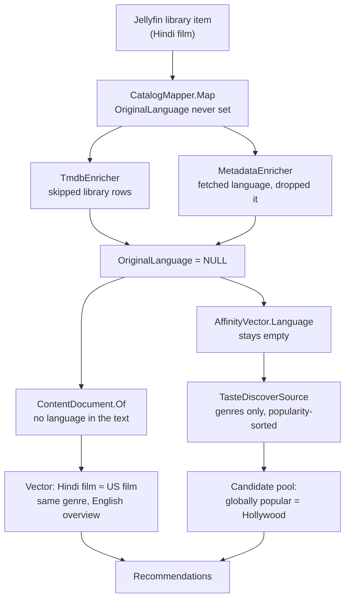

# Taste & Language Gap — Findings

*Why Orca Engine under-served a viewer whose taste is mostly non-English, what the causes actually were, and what changed.*
*Investigated and fixed 2026-08-19. Shipped in **1.2.0.0-beta**. All line references are against that tree.*

> **Beta.** Orca Engine is pre-1.0 in everything but the version number. This release changes the
> embedding layer substantially and **removes TF-IDF**, so an existing install needs an Ollama
> server before content similarity works again — see §9. Expect to read the alert banner.

---

## 1. The report

A household account watches predominantly Hindi-language film and television. Roughly **a quarter** of what surfaced for that account was Bollywood; the rest was English-language content in matching genres. The only row that consistently got it right was **For You**, which is LLM-curated.

That last detail was the clue. The LLM reads actual titles out of the watch history, so it recognises "Bollywood" as a concept. Every other surface goes through the vector and scoring path — and that path could not see language at all.

The user's own summary was accurate: *"so the vectors isn't working???"* They were running. They were blind.

---

## 2. Root cause chain

Four independent faults, stacked. Any one of them alone would have been survivable.



### Cause 1 — Language was never learned from the library

The affinity machinery for language existed and worked. `CatalogFeatures` feeds `item.OriginalLanguage` into the `Language` dimension at [CatalogFeatures.cs:74](../Wholphin.Engine/Personalization/CatalogFeatures.cs#L74), and `CandidateScorer` reads it back at [CandidateScorer.cs:182](../Wholphin.Engine/Discovery/CandidateScorer.cs#L182).

The field was simply always `NULL` for anything in the library:

| Writer | Behaviour before |
|---|---|
| `Sync/CatalogMapper.cs` | Projects Jellyfin → catalog. Never set `OriginalLanguage`; Jellyfin does not expose it on `BaseItem`. |
| `Catalog/TmdbEnricher.cs` | Query filtered `.Where(c => c.JellyfinItemId == null …)` — library rows structurally excluded. |
| `Metadata/MetadataEnricher.cs` | Did select library rows, and `MetadataMerge` merged `OriginalLanguage` into the fragment — but `Apply` never wrote it to the row. A dead field, fetched and discarded on every pass. |

So for every title the viewer had actually watched, the engine did not know what language it was in.

### Cause 2 — The embedding document had no language

`ContentDocument.Of` built its text from title, year, media type, genres, studios, cast, tags, overview. No language, no country, no original title.

TMDB overviews are written in English regardless of the film's origin. The practical consequence: **a Hindi drama and an American drama produced near-identical vectors.** Cosine similarity had nothing to separate them on.

### Cause 3 — Silent fallback to TF-IDF

`EmbeddingProvider` defaults to `"tfidf"` ([PluginConfiguration.cs:591](../Wholphin.Engine/Configuration/PluginConfiguration.cs#L591)). A configured cloud provider was used only if it resolved *and* reported `IsConfigured`. Both failure paths fell back to local TF-IDF with nothing more than a log warning — which is gone from the ring buffer by morning.

The user had set up a cloud embedding and could not tell whether it was working. There was no way to tell.

### Cause 4 — The candidate pool was a global popularity contest

`TasteDiscoverSource` queried TMDB `/discover` filtered to the viewer's top genres, sorted `popularity.desc`, with `MovieVoteFloor = 200`.

Two problems compounded:

- **No language filter.** Global TMDB popularity is dominated by English-language releases.
- **The vote floor was calibrated on the wrong population.** 200 votes is a sensible "not obscure" bar for worldwide English releases. Applied to Hindi cinema it removes most of a national industry rather than removing the obscure.

The only Hindi-aware query anywhere in the engine was `CountrySource` (`IN` → `hi`, [CountryLanguages.cs](../Wholphin.Engine/Discovery/CountryLanguages.cs)) — and that powers a **global** row, "What people are watching in India". It was never personal.

---

## 3. Secondary findings

Three further problems surfaced during the investigation. All three were independently capable of hollowing out a profile.

### 3.1 No watch history was ever imported

`BehaviorEntryPoint` subscribes to `PlaybackStart`, `PlaybackStopped` and `UserDataSaved`. That is the complete set of inputs. **Everything watched before the plugin was installed was invisible**, and no backfill existed anywhere in the repository.

Compounding truncations on top of that:

| Limit | Value | Effect |
|---|---|---|
| Pre-install history | 0 events | The entire viewing past |
| `TasteProfileService.MaxSeeds` | 40 | Taste vector built from ≤40 titles |
| `DiscoveryTuning.LlmHistoryCap` | 20 | The LLM sees 20 titles |
| `PersonalizationService.HalfLifeDays` | 90 | 6 months ago = ¼ weight; a year = ~1/16 |

### 3.2 Retention was deleting history, not just ignoring it

`BehaviorRetentionDays` defaulted to **400**. Recompute filtered on it — and, less visibly, `JellyseerrMaintenanceWorker` ran `ExecuteDeleteAsync` against every event past the cutoff **every 15 minutes**.

An imported history would have been physically destroyed within a quarter of an hour of the import finishing. This was not found in the first pass; the initial grep covered `Behavior/`, `Personalization/` and `Data/` and missed the pruner in `Catalog/`.

### 3.3 Multi-provider metadata was not helping recommendations

Four providers exist — `tmdb`, `omdb`, `tvdb`, `fanart` — but their reach is narrower than it looks:

- They fill **display** gaps (artwork, logos, ratings), guarded by `IsNullOrWhiteSpace` throughout.
- **Candidate generation is 100 % TMDB.** All four non-LLM discovery sources take `ITmdbClient` and nothing else.

Multi-provider improved what cards looked like. It did not change what was recommended.

---

## 4. What changed

552 tests passing, 0 warnings.

### 4.1 Language reaches the vector

| Change | Location |
|---|---|
| Document emits `Language: hi, Hindi.` after the media type, in **both** overloads | [ContentDocument.cs:40](../Wholphin.Engine/Embedding/ContentDocument.cs#L40), helper at [:94](../Wholphin.Engine/Embedding/ContentDocument.cs#L94) |
| A null `OriginalLanguage` now counts as missing `Core` | [MetadataEnricher.cs:177](../Wholphin.Engine/Metadata/MetadataEnricher.cs#L177) |
| `Apply` writes `fragment.OriginalLanguage` to the row | [MetadataEnricher.cs:272](../Wholphin.Engine/Metadata/MetadataEnricher.cs#L272) |
| Library rows admitted for language **only**; artwork writes guarded | [TmdbEnricher.cs:64](../Wholphin.Engine/Catalog/TmdbEnricher.cs#L64) |

Both the ISO code and the English name are emitted. The code is a stable token TF-IDF can key on even where the runtime has no ICU data; the name is what a neural embedder and the LLM re-ranker actually understand. `CultureInfo.GetCultureInfo(code).EnglishName` does the lookup — no new table — guarded against globalization-invariant runtimes, which answer "Invariant Language" for everything.

> **Do not "simplify" `TmdbEnricher` by deleting its `JellyfinItemId == null` filter.** Library rows have genres from Jellyfin but essentially never a `PosterImageUrl`, so a bare deletion matches the entire library on the poster clause — dragging every title through TMDB and overwriting the artwork Jellyfin already serves. The filter was widened for the language clause specifically, and the two artwork writes are now wrapped in `if (item.JellyfinItemId is null)`.

Because `CatalogFeatures` already fed `OriginalLanguage` into the affinity vector, the `Language` dimension starts working on its own once rows backfill. No change was needed there.

### 4.2 The candidate pool learned about language

`UserTasteProfile` gained `TopLanguages` — top 2 from `affinity.Language`, same `TopFeatureThreshold = 0.35` and same helper as `TopGenres`. It is written into the profile JSON, so it is inspectable.

`TasteDiscoverSource` now runs two legs per media type:

| Leg | Filter | Vote floor |
|---|---|---|
| 1 | Top genres | 200 movie / 50 series *(unchanged)* |
| 2 | Top genres **+ `with_original_language`** | **25** ([:44](../Wholphin.Engine/Discovery/Sources/TasteDiscoverSource.cs#L44)) |

English is skipped ([PullLanguages, :129](../Wholphin.Engine/Discovery/Sources/TasteDiscoverSource.cs#L129)) — leg 1 is already an English leg in all but name, since TMDB popularity ordering surfaces English titles regardless. A second round trip asking for them again buys nothing.

The lower floor on leg 2 is the deliberate part. Within one language the pool is already small; a bar calibrated against worldwide English releases is the mechanism that created the gap.

### 4.3 Watch history import

`Behavior/WatchHistoryImporter.cs` — a one-time full backfill over `IUserDataManager`.

- **Full scan** of every Movie, Series and Episode ([:151](../Wholphin.Engine/Behavior/WatchHistoryImporter.cs#L151)) rather than the cheaper played-only query, which misses anything rated but never finished.
- **Episodes roll up to their series.** The catalog holds Movies and Series, so an event on an episode id resolves to nothing.
- **Caps** — 3 plays per title, 5 episodes per series ([:53](../Wholphin.Engine/Behavior/WatchHistoryImporter.cs#L53)). A rewatched film should outweigh a watched-once film; a 60-episode binge should not outweigh it sixtyfold.
- **Original timestamps preserved**, so the 90-day decay still ranks recent over ancient.
- No play date → `MarkedPlayed` (weight 3) rather than `PlaybackCompleted` (weight 5). Marking is not watching.
- **Idempotent** via a `ContextJson` marker ([:42](../Wholphin.Engine/Behavior/WatchHistoryImporter.cs#L42)); a re-run replaces only its own rows and never touches live-captured events.
- Recomputes affinity and rebuilds the taste profile inline per user, so the confidence figure lands while the operator watches.

Endpoints, admin-only: `POST` / `GET OrcaEngine/Behavior/ImportHistory` ([BehaviorController.cs:65](../Wholphin.Engine/Controllers/BehaviorController.cs#L65)).

The Observatory Users page polls at 2 s and shows a per-user progress bar, events written, unresolved count, and post-import confidence — green at or above `TargetConfidence = 0.80`.

### 4.4 Retention removed entirely

`BehaviorRetentionDays`, `PersonalizationService.RetentionCutoff()`, both timestamp filters, the Jellyfin config input, the Observatory setting, **and the `JellyseerrMaintenanceWorker` prune block** are all deleted.

Affinity and taste seeds now read every event a user has ever produced. The 90-day half-life is the only thing that ages a signal — which is the correct mechanism: it weights old history down instead of destroying it.

> **Do not reintroduce a retention window.** It bought nothing the decay was not already doing, and it silently deleted imported history.

### 4.5 Degradation is now visible

`Diagnostics/EngineAlerts.cs` — sticky, self-clearing health conditions, surfaced through `Observatory/Snapshot` as a red banner pinned above the navigation on every page.

This exists because `IEngineEvents` is a bounded ring: a warning emitted at 3 a.m. is gone by morning, and nobody watches the live log. `EmbeddingService` raises a **critical** alert on both fallback paths — provider called-and-failed ([:71](../Wholphin.Engine/Embedding/EmbeddingService.cs#L71)) and provider selected-but-unconfigured ([:112](../Wholphin.Engine/Embedding/EmbeddingService.cs#L112)) — and clears it on the next successful call.

---

## 5. Still open

Both of the substantial items from the first pass are now closed — §8 covers the embedding
pipeline, §9 the provider change. What remains is small.

- **`null` conflates transient with permanent failure.** `IEmbeddingProvider.EmbedAsync` returns
  `null` for both, so a provider answering 400 burns all three retries pointlessly. Bounded, so the
  cost is a few seconds; a richer failure type would let a permanent error skip its retries.
- **`MetadataEnricher.Apply` still fetches and drops** `Keywords`, `People`, `Year`,
  `RuntimeMinutes`, `CollectionName`. Keywords in particular would be strong vector signal — TMDB
  tags Hindi cinema with terms the overview never contains.
- **`Configuration/config.html` still hosts 62 input elements**, against the standing constraint
  that data entry belongs only in the Orca Observatory.
- **Vector blobs use machine-native float layout.** Moving the database between machines of
  different endianness invalidates them. The stored `Dimensions` check catches a truncated read, not
  a byte-swapped one.
- **Deliberately skipped:** `OriginalTitle` in the embedding document. `DiscoverResult` has no such
  field, so including it would make the two `ContentDocument.Of` overloads asymmetric — and seeds
  and candidates are embedded in one batch, where a label only one side can produce becomes a term
  that only ever appears on one side of the comparison.

---

## 6. Order of operations

The fixes are order-dependent. Running them out of order produces a profile built against stale documents.

1. **Stand up an embedding provider.** `ollama pull nomic-embed-text`, point **Settings → Embeddings → Ollama URL** at the server, then press **Test provider** on the Embeddings page. Green before anything else — see §9.
2. **Let the maintenance sweep backfill `OriginalLanguage`.** 15-minute ticks, budgeted per pass; a large library takes time.
3. **Run "Import all watch history"** from the Observatory Users page.
4. **Check the profile JSON** at `{DataPath}/wholphin-engine/profiles/{userId:N}.json` for `topLanguages: ["hi"]` and a confidence at or above 0.80.
5. **Watch the alert banner.** If the embedding provider is misconfigured or failing, it now says so.

Re-running the import later is safe and cheap, so waiting on step 2 is a preference rather than a requirement.

---

## 7. Reference

### Constants worth knowing

| Constant | Value | Location |
|---|---|---|
| `HalfLifeDays` | 90 | [PersonalizationService.cs:26](../Wholphin.Engine/Personalization/PersonalizationService.cs#L26) |
| `ConfidenceFullAt` | 30 events | [PersonalizationService.cs:29](../Wholphin.Engine/Personalization/PersonalizationService.cs#L29) |
| `MaxSeeds` | 40 | [TasteProfileService.cs:28](../Wholphin.Engine/Personalization/TasteProfileService.cs#L28) |
| `TopFeatureThreshold` | 0.35 | [TasteProfileService.cs:31](../Wholphin.Engine/Personalization/TasteProfileService.cs#L31) |
| `MinConfidence` | 0.40 | [DiscoveryTuning.cs:15](../Wholphin.Engine/Discovery/DiscoveryTuning.cs#L15) |
| `LlmHistoryCap` | 20 | [DiscoveryTuning.cs:36](../Wholphin.Engine/Discovery/DiscoveryTuning.cs#L36) |
| `TargetConfidence` | 0.80 | [WatchHistoryImporter.cs:48](../Wholphin.Engine/Behavior/WatchHistoryImporter.cs#L48) |
| `LanguageVoteFloor` | 25 | [TasteDiscoverSource.cs:44](../Wholphin.Engine/Discovery/Sources/TasteDiscoverSource.cs#L44) |
| `EmbeddingProvider` default | `"tfidf"` | [PluginConfiguration.cs:591](../Wholphin.Engine/Configuration/PluginConfiguration.cs#L591) |

### Files added

| File | Purpose |
|---|---|
| `Behavior/IWatchHistoryImporter.cs` | Import contract and progress records |
| `Behavior/WatchHistoryImporter.cs` | The backfill itself |
| `Diagnostics/IEngineAlerts.cs` | Sticky health-condition contract |
| `Diagnostics/EngineAlerts.cs` | Keyed alert store |

### Tests

| File | Covers |
|---|---|
| `WatchHistoryImportTests.cs` | Event synthesis, rewatch and series caps, timestamp preservation |
| `ContentDocumentTests.cs` | Language in the document, overload symmetry, unknown codes |
| `TasteDiscoverLanguageTests.cs` | Which languages earn a TMDB leg |
| `MetadataMergeTests.cs` *(extended)* | Language as a `Core` capability, write-back, no-overwrite |

### Why "For You" was always the good row

`LlmCandidateSource` carries confidence **0.95**, above every TMDB source, and is primary when LLM discovery is on. It reads real titles from the history, so it recognises a national cinema as a concept without needing any of the machinery above.

That row was not evidence the engine worked. It was evidence of what the rest of the engine could not see.

---

## 8. Embedding pipeline

Rewritten after §5.1 was re-diagnosed. 36 tests cover it.

### Bounded batches

`IEmbeddingProvider.MaxBatchSize` lets the batching layer size its calls without branching on the
provider's name. `EmbeddingBatchSize` (default **96**) is clamped to `[8, 512]` and to whatever the
provider itself accepts — Ollama declares 32, because it processes a request's inputs serially and a
large batch is one long request that hits the timeout rather than a faster round trip. The 512
ceiling is what stops a mistyped value recreating the original whole-catalog request.

### No fallback, by construction

If the configured provider cannot finish, the run **fails**. It does not substitute another model:
`ContentVector.Cosine` scores differently-sized vectors as 0, so a patched index would make the
substituted items invisible against everything else, with no error anywhere.

The safety net is one level up — the index keeps the last snapshot that built cleanly — and a
critical alert goes up. Recommendations keep working; they stop reflecting newly added titles.

### Lifecycle

| Concern | Behaviour |
|---|---|
| Retry | 3 attempts per batch, backoff `2s × attempt`. HTTP 429 is retried one level down inside the provider, which can read `Retry-After`; retrying again here would multiply the two budgets into a storm. |
| Unconfigured provider | Caught at resolve, never called, never retried. Checked for the *default* provider too — a fresh install with no Ollama URL is the common silent case. |
| Cancellation | Propagates. Never treated as provider failure. |
| Malformed result | A batch whose vector count differs from its document count is rejected outright — a short result cannot say which documents it skipped. |
| Active-index replacement | Built off to the side; visible only on success. A failed rebuild returns the last known-good snapshot and retries in 10 minutes instead of caching failure for 6 hours. |
| Concurrency | `SingleFlight` coalesces simultaneous rebuilds into one. |

### Persistence and incremental rebuilds

Vectors are stored in `CatalogItemVectors` (schema **v12**), each row stamped with the `Provider`,
`ModelId` and `DocumentHash` that produced it. All three must match before a stored vector is reused.

The hash is not optional. Backfilling a title's original language **rewrites its document** — the
exact thing §4.1 does — and without the hash the engine would keep serving the vector that never
knew about it.

Because "have I got one?" and "is it still valid?" became the same question, rebuilds are
incremental for free:

| Event | Embedding calls |
|---|---|
| Restart | none |
| Ten titles added | ten |
| One title's metadata edited | one |
| Model changed | all of them, as it must |

Rows from any other provider or model are deleted on load; vectors for deleted titles are pruned on
save, so the table does not grow forever.

### Proving the provider actually works

Every other embedding signal is negative — an alert fires on failure, so a quiet dashboard means
"nothing failed since startup", which includes "nothing was tried". The **Embeddings** page closes
that with a positive check.

`POST /OrcaEngine/Embedding/Test` embeds three probe texts — two near-identical, one unrelated — and
reports latency, dimensions, and both cosines. It calls the provider **directly, bypassing
resolution**, so a dead provider cannot be answered for by another.

The two cosines are the point. A provider can answer HTTP 200 with a well-formed response, the right
count, and constant vectors that carry no meaning — that passes a connectivity check and fails this
one, because the related pair would not score above the unrelated pair. Reported as `healthy` or
`suspect`.

---

## 9. TF-IDF removed, Ollama is the default

**Breaking for existing installs.** Local TF-IDF is gone, along with `TfIdfModel`, `ContentTokens`,
and the entire sparse branch of `ContentVector` — which is now dense-only.

### Why the removal simplified things

Sparse and dense vectors scored **0** against each other, so "an index must never mix providers" was
a rule the type system could not enforce. One representation makes that class of bug
unrepresentable. The `EmbeddingBatching` enum went with it: it existed solely to stop TF-IDF being
split, and with no corpus-fitted provider left, `MaxBatchSize` says everything.

### What you have to do

```bash
ollama pull nomic-embed-text
```

Then set **Ollama URL** (default `http://localhost:11434`) and **Ollama model** under
Settings → Embeddings, and press **Test provider**.

`OllamaEmbeddingProvider` subclasses the existing OpenAI-shaped base — Ollama serves a genuinely
OpenAI-compatible `/v1/embeddings` — with three swaps: the endpoint comes from configuration,
readiness means "a base URL is set" rather than "a key is set", and no Authorization header is sent.

### What survives without it

Your taste graph does not depend on embeddings. Behavior events, affinity vectors (genre, language,
person, studio, …) and the profile `Seeds` are all computed by `PersonalizationService` and are
untouched. The stored taste vector was only ever a cache over the seeds, recomputed on demand.

Inert until a provider answers: **More Like This**, and the taste blend on the trending row. Still
working: the LLM "For You" row, all affinity scoring, the TMDB discover legs including the language
leg from §4.2, and Because You Watched.

### The risk this accepts

TF-IDF was the only in-process provider that could not fail. Ollama is a separate process. A running
server is covered by the last-known-good index; **a restart with Ollama down is not** — though since
§8's persistence landed, the index is reloaded from the database rather than rebuilt, so this now
only bites when the stored vectors are also invalid (first run, or a model change).
